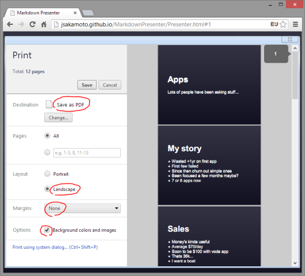

# Markdown Presenter - npm package edition

*For when you're giving a presentation in half an hour, and you haven't got the time to open up keynote.*

## Summary

This is command line tool for start presentation slides in any Web browser from your markdown file - powered by "[Markdown Presenter](https://github.com/jsakamoto/MarkdownPresenter)".


## Prerequirements

- Windows / macOS / Linux etc.
- Installed node.js and npm (node.js package manager)

## How to install

```shell
$ npm install md-presenter -g
```

## How to use

1. Create markdown file (separate slides is a paragraph with an exclamation mark)
2. Enter `md-presenter` command from terminal console.
3. Then, `md-presenter` detect markdown file in current directory, and start built-in HTTP server, and launch web browser to start presentation automatically. 

```shell
$ cd (anywhere you want to work)
$ echo "# Hello World" > any-flename-you-prefer.md
$ md-presenter
```

## Markdown file format

The file which you will create and has `.md` file extention is where you put your presentation. All you need to do to separate slides is a paragraph with an exclamation mark, eg:

```
This is a slide
Blah blah blah

!

This is another slide
Yada yada yada
```

## Operation

### Switching between slides

Use the **arrow keys** on your keyboard or **swipe horizontally** on touch screen to switch between slides.

### Reloading

You can reload the presentation at any time - staying on the same slide number - by pressing the spacebar.

The other way, you can enable "**Auto Reload**" mode by typing `A` key.
In "Auto Reload" mode, Markdown Presenter is watching the change of markdown file and reload it automatically.

### Transition effect

If you whould like to get fade in/out effect on switching between slides, type `e` then `f` key on your keyboard.
To reset this transition effect, type `e` then `n`.

### Direct page jump

You can jump to the any slide which you want to show directly by 3 ways as follow:

- by PowerPoint compatibe keyboard shortcut, such as `2`,`1`,`Enter` then jump to the slide at 21.
- by chosing slide index from drop down list at bottom-right of the browser window.
- by specification hash tag of URL.

## Printing Support

Markdown Presenter can print out the all slides to any printer from browser printing feature.



The keys to get fine result is follow:

- Layout - Landscape
- Margins - No margin
- Options - Enable to printing background colors

And you can print out as a PDF file, so you can also upload and publish your slides to "slideshare.net".

## See also...

**Markdown Presenter** - original edition  
https://github.com/jsakamoto/MarkdownPresenter